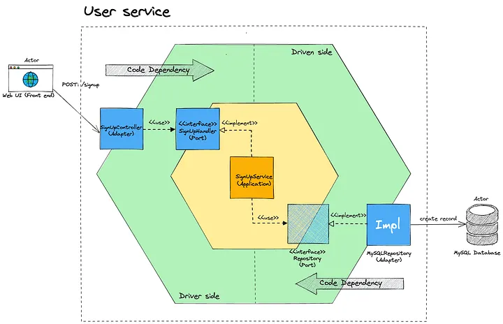

# Backend Test Project

A backend service built with Go that interacts with the Skinport API to manage items and handles user balances and purchases.

## Features

-   **Item Management**: Fetches and caches items from the Skinport API.
    -   **Caching**: Uses in-memory caching for items, updated every minute via a cron job to ensure data freshness while respecting rate limits.
-   **User Management**:
    -   View user balance.
    -   Top-up user balance.
    -   Purchase items (deducts from user balance based on item's minimum price).
-   **Database**: Uses PostgreSQL for persistent user data storage.

## 🏗️ Project Architecture



### Abstraction Layers

The project is organized using a **hexagonal layered architecture**:

```
┌─────────────────────────────────────┐
│      Driving Adapter Layer          │  ← HTTP, gRPC, AMQP, etc.
├─────────────────────────────────────┤
│         Use Case Layer              │  ← Business Logic
├─────────────────────────────────────┤
│          Service Layer              │  ← Tools for Use Cases
├─────────────────────────────────────┤
│       Driven Adapter Layer          │  ← DB, External Services
└─────────────────────────────────────┘
```

Communication between all layers is organized via interfaces to ensure loose coupling and ease of testing.

## Prerequisites

-   Go 1.22+
-   PostgreSQL

## Installation

1.  **Clone the repository**:
    ```bash
    git clone <repository-url>
    cd backend-test
    ```

2.  **Database Setup**:
    -   Ensure PostgreSQL is running.
    -   Create a database (e.g., `backend_test`).
    -   Run migrations (located in `migrations/`).

3.  **Configuration**:
    Create a `.env` file in the root directory (based on example below) or set environment variables:

    | Variable | Description | Default / Example |
    | :--- | :--- | :--- |
    | `SERVER_PORT` | Port for the HTTP server | `8080` |
    | `DB_HOST` | Database host | `localhost` |
    | `DB_PORT` | Database port | `5433` |
    | `DB_USER` | Database user | `backend_test` |
    | `DB_PASSWORD` | Database password | `123456` |
    | `DB_NAME` | Database name | `backend_test` |
    | `DB_SSL_MODE` | Database SSL mode | `disable` |
    | `SKINPORT_API_BASE_URL` | Skinport API URL | `https://api.skinport.com` |
    | `ITEMS_CRON_EXPRESSION` | Cron for item updates | `*/1 * * * *` |
    | `LOG_LEVEL` | Logging level | `INFO` or `DEBUG` |

## Usage

### Run Locally

Use the Makefile to run the application:

```bash
make run
```

### Build

```bash
make build
```

## API Documentation

### Items

-   **Get All Items**
    -   **URL**: `GET /api/items`
    -   **Description**: Returns a list of all items (cached).
    -   **Response**:
        ```json
        [
            {
                "market_hash_name": "AK-47 | Aquamarine Revenge (Battle-Scarred)",
                "currency": "USD",
                "suggested_price": 13.18,
                "min_price": 11.33,
                "quantity": 25,
                ...
            }
        ]
        ```

-   **Get Item by Name**
    -   **URL**: `GET /api/items/:market_hash_name`
    -   **Example**: `/api/items/AK-47 | Aquamarine Revenge (Battle-Scarred)`

### Users

-   **Get User**
    -   **URL**: `GET /api/user/:id`
    -   **Response**:
        ```json
        {
            "id": 1,
            "balance": 12.5
        }
        ```

-   **Top Up Balance**
    -   **URL**: `POST /api/user/:id/top-up`
    -   **Body**:
        ```json
        {
            "amount": 100.0
        }
        ```

-   **Purchase Item**
    -   **URL**: `POST /api/purchase`
    -   **Description**: Purchases an item using user balance. Identifies item by `market_hash_name` and uses its current minimum price.
    -   **Body**:
        ```json
        {
            "user_id": 1,
            "market_hash_name": "AK-47 | Aquamarine Revenge (Battle-Scarred)"
        }
        ```

## Technical Details

### Caching Strategy
Items are cached in-memory and updated via a cron job every minute. This avoids hitting the Skinport API rate limits (8 requests/5 mins) while keeping data relatively fresh.

### Balance Operations
User balance is updated using atomic database operations to ensure consistency.
-   **Withdraw**: Checks for sufficient funds before identifying the transaction.
-   **Top Up**: Increases user balance atomically.